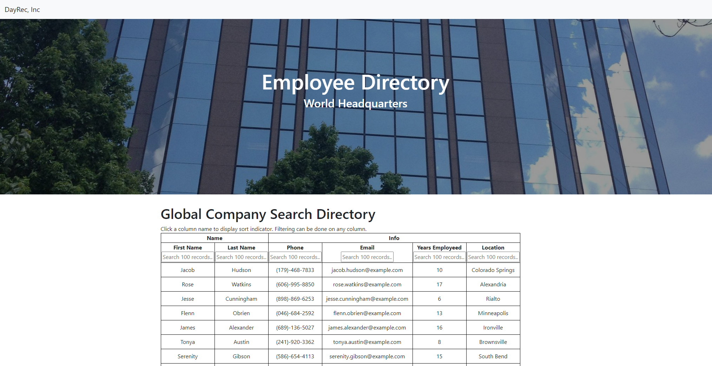
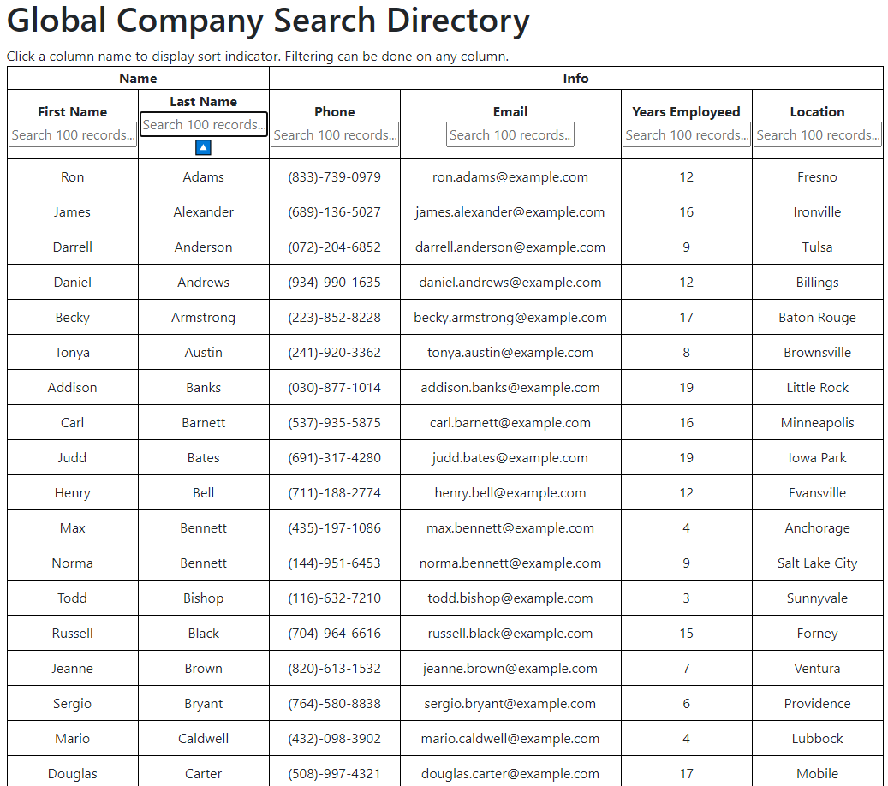
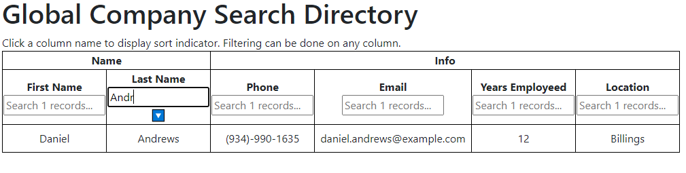

# React Employee Directory
 Employee directory app using React and React Table allows you to sort and filter company employees.  The application's UI is broken into components, manages component state, and responds to user events.

# Usage
You can view the live deployed app on GitHub Pages here [Deployed Note Taker App ](https://jodybrzo.github.io/employeedirectory/)

---

### React Table is populated with the employee API that is being saved in state.

---

### Click on any column header and click the blue sort indicator to sort any column ascending or descending.

---

### Use the text fields under any column header to filter the results.

---

# Table of Contents 

* [Technology used](#Technology%20used)
* [Installation](#Installation)
* [Usage](#Usage)
* [License](#License)

# Technology used

* React, useEffect and use State
* express
* npm
* AXIOS
* React Table
* Bootstrap

# Installation 

From the command line change directory to where you cloned this repo to then type 'npm install', then to run it type 'npm start'

# License
MIT License

Copyright (c) 2021 JodyBrzo

Permission is hereby granted, free of charge, to any person obtaining a copy 
of this software and associated documentation files (the "Software"), to deal
in the Software without restriction, including without limitation the rights
to use, copy, modify, merge, publish, distribute, sublicense, and/or sell
copies of the Software, and to permit persons to whom the Software is
furnished to do so, subject to the following conditions:

The above copyright notice and this permission notice shall be included in all
copies or substantial portions of the Software.

THE SOFTWARE IS PROVIDED "AS IS", WITHOUT WARRANTY OF ANY KIND, EXPRESS OR
IMPLIED, INCLUDING BUT NOT LIMITED TO THE WARRANTIES OF MERCHANTABILITY,
FITNESS FOR A PARTICULAR PURPOSE AND NONINFRINGEMENT. IN NO EVENT SHALL THE
AUTHORS OR COPYRIGHT HOLDERS BE LIABLE FOR ANY CLAIM, DAMAGES OR OTHER
LIABILITY, WHETHER IN AN ACTION OF CONTRACT, TORT OR OTHERWISE, ARISING FROM,
OUT OF OR IN CONNECTION WITH THE SOFTWARE OR THE USE OR OTHER DEALINGS IN THE
SOFTWARE.